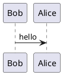
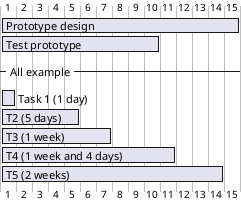

# Diagrams in mkdocs

mkdocs comes with a lot of plugins, some of them are really essential when creating technical documentation, such as UML diagrams.

## Plantuml

[mkdocs plantuml](https://github.com/MikhailKravets/mkdocs_puml)

Syntax;

```
    \`\`\`puml
    @startuml
    Bob -> Alice : hello
    @enduml
```



<br>

